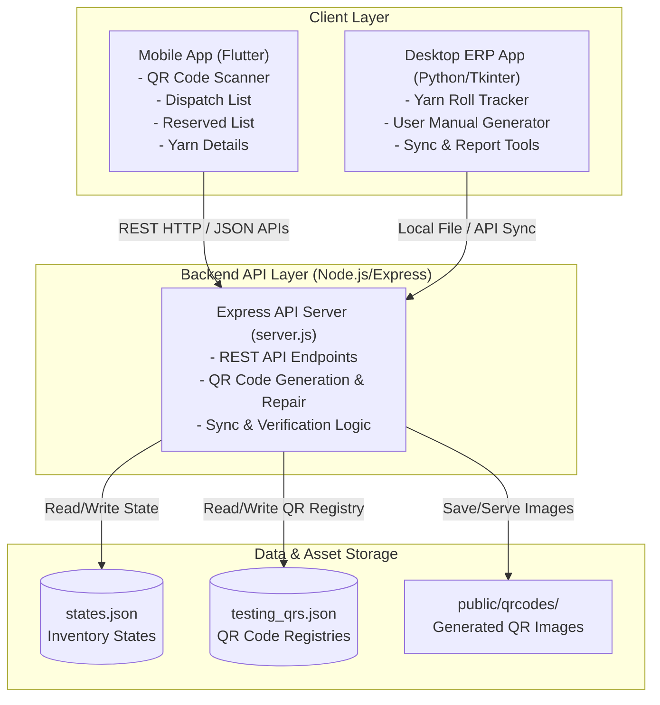
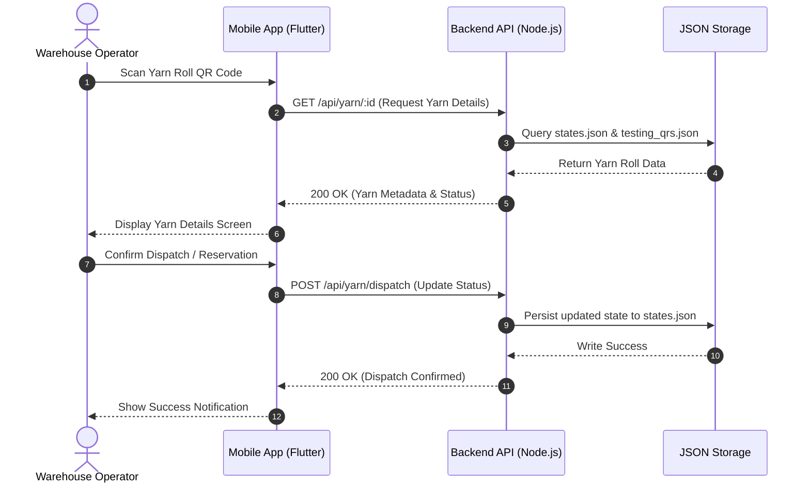

# Smart QR Inventory System Architecture

This document describes the system architecture, components, and data flow of the **Smart QR Inventory System**.

---

## 1. High-Level Architecture Diagram



---

## 2. Component Overview

| Component | Technology | Primary Responsibilities |
| :--- | :--- | :--- |
| **Mobile App** | Flutter / Dart | Mobile QR scanner interface, managing dispatch lists, yarn reservations, and detailed roll inspection. |
| **Desktop App** | Python / PyInstaller | Desktop ERP system for yarn roll tracking, report generation, manual creation, and desktop operations. |
| **Backend API** | Node.js / Express | Centralized REST API server for state management, inventory synchronization, and QR code asset management. |
| **Storage Layer** | JSON File Store / Static Assets | Lightweight persistence for inventory states, roll tracking records, and generated QR code image files. |

---

## 3. Data Flow Sequence

### QR Code Scanning & Inventory Dispatch Flow



---

## 4. Repository Directory Structure

```
smart-qr-inventory-system/
├── README.md
├── ARCHITECTURE.md
├── .gitignore
├── Yarn-Manager-Mobile-App/         # Flutter Mobile Application
│   ├── lib/                         # App pages, widgets, and services
│   ├── android/                     # Android build configuration
│   └── pubspec.yaml                 # Dependencies and assets
└── Yarn-Tracker-Desktop-App - Copy/ # Python Desktop App & Node.js Backend
    ├── app.py                       # Python Desktop GUI Application
    ├── backend/                     # Node.js Express Backend API
    │   ├── server.js                # API server & routes
    │   ├── public/qrcodes/          # Generated QR code image assets
    │   └── states.json              # Inventory state database
    └── requirements.txt             # Python dependencies
```
