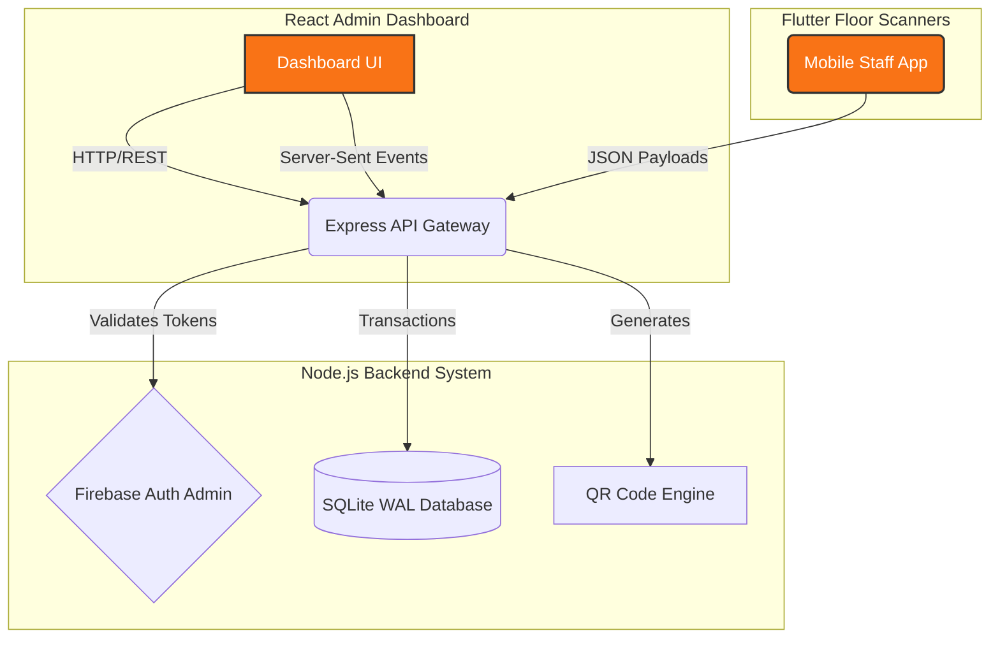
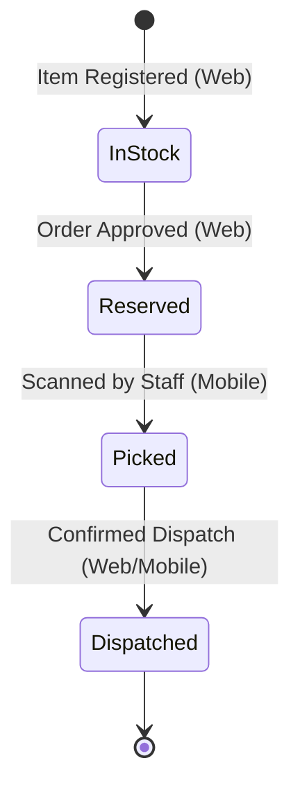

<div align="center">
  
  <h1>📦 ScanTrack Desktop - Admin Hub</h1>
  <p><strong>A production-ready ERP Dashboard for Warehouse and Inventory Management</strong></p>
</div>

---

## 🚀 Overview

**ScanTrack Desktop** is the core operational hub and central server for the ScanTrack inventory system. Designed for managers and warehouse admins, this system provides real-time oversight of inventory levels, product lifecycles, and order processing.

It acts as a secure, fast, and robust **Control Center** wrapping a modern React UI over an Express.js backend, powered by an optimized SQLite database with WAL concurrency. 

### 🌟 Key Features

- 🔐 **Role-Based Access Control (RBAC):** Firebase-backed Authentication with `admin` and `staff` tiering.
- 📊 **Real-Time Analytics:** Live dashboard with Server-Sent Events (SSE) reflecting the warehouse floor instantly.
- 📦 **End-to-End Item Tracking:** Manage products from *In Stock* to *Reserved*, *Picked*, and *Dispatched*.
- 🖨️ **Automated QR Generation:** Creates structured QR codes for products instantly upon registration.
- ⚡ **Concurrency-Optimized Backend:** SQLite operates in WAL mode ensuring flawless parallel mobile scans.
- 🛡️ **Hardened API:** Protected by Helmet, Joi request validation, rate limiting, and Winston structured logging.

---

## 🏗️ System Architecture



---

## 🔄 App Flow & Lifecycle

Products in ScanTrack follow a strict operational pipeline managed from this dashboard:



---

## 🛠️ Technology Stack

| Component | Technology | Description |
|-----------|------------|-------------|
| **Frontend** | React + Vite | Fast, responsive UI with TailwindCSS |
| **State Sync** | React Query | Auto-refetching and cache management |
| **Backend** | Node.js / Express | Fast, scalable REST API |
| **Database** | SQLite (WAL) | Local database with concurrency guarantees |
| **Auth** | Firebase Auth | Secure identity and token verification |

---

## ⚙️ Quick Start

### 1. Prerequisites
- **Node.js** (v18+)
- **Firebase Project** (with Email/Password & Google Auth enabled)

### 2. Setup
Clone the repository and install dependencies:
```bash
git clone https://github.com/Jayaprakash3704/smart-qr-inventory-system.git
cd ScanTrack-Desktop-App/backend
npm install
```

### 3. Configuration
Rename `.env.example` to `.env` inside the `backend` folder and add your credentials:
```env
ADMIN_EMAIL=your-email@example.com
ADMIN_PASSWORD=your-secure-password
GOOGLE_APPLICATION_CREDENTIALS=service-account.json
```
*(Make sure to download your Firebase Service Account JSON and save it as `service-account.json` in the backend folder!)*

### 4. Run the Server
```bash
npm run dev
```
Your backend will start on `http://localhost:5000` and automatically create your admin account.

### 5. Run the Dashboard
Open a new terminal and run:
```bash
cd ScanTrack-Desktop-App/web
npm install
npm run dev
```
Visit `http://localhost:3000` to access the Admin Hub!

---

## 🛡️ Production & Troubleshooting

- **Database Backups:** An automated backup script (`backup.js`) runs daily at 2:00 AM, keeping a 7-day retention of your SQLite DB.
- **SQLite Locking (`SQLITE_BUSY`):** Ensure you are running Node on a filesystem that supports WAL (local disk, not a network mount).
- **Authentication Failures (401):** Ensure your frontend is pointing to the exact Firebase project ID linked to your backend's `service-account.json`.

---
*Built with precision for modern warehouse operations.*
