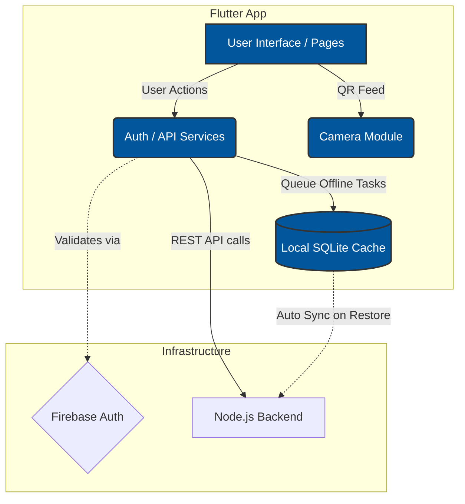
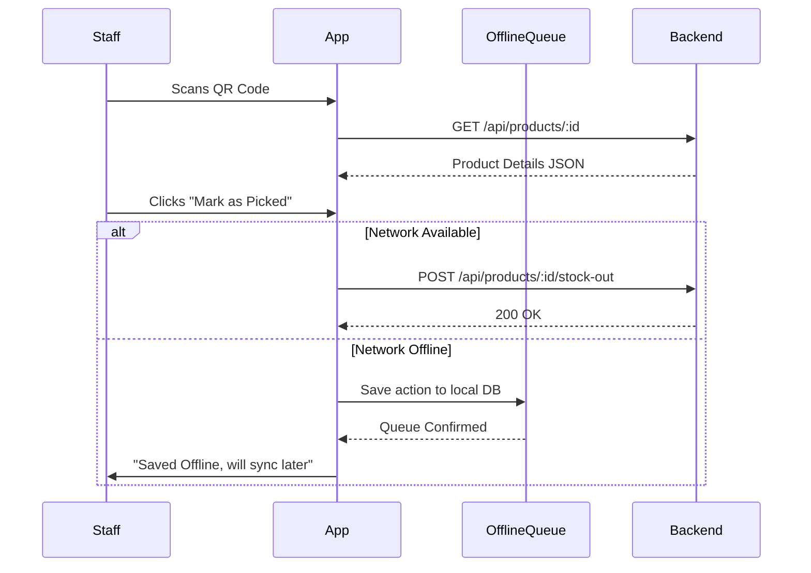

<div align="center">
  
  <h1>📱 ScanTrack Mobile - Floor Operations</h1>
  <p><strong>A lightning-fast Flutter app for warehouse staff to scan and process inventory.</strong></p>
</div>

---

## 🚀 Overview

**ScanTrack Mobile** is the staff-facing component of the ScanTrack ecosystem. Built with Flutter, this app is designed to be highly responsive, robust, and capable of operating flawlessly in fast-paced warehouse environments. 

It empowers warehouse floor workers to instantly retrieve product details, process stock movements, and fulfill customer orders simply by scanning QR codes.

### 🌟 Key Features

- 📷 **High-Speed QR Scanning:** Instant recognition of custom ScanTrack QR UUIDs and JSON payloads.
- 📡 **Offline-First Synchronization:** The `OfflineSyncService` locally queues actions (like Stock Ins/Outs) if network connectivity drops, syncing automatically when reconnected.
- 🔐 **Secure Authentication:** Deeply integrated with Firebase Auth & Google Sign-in to ensure secure staff access.
- 🚀 **Cross-Platform:** Compiles seamlessly to Android and iOS from a single codebase.
- 🎨 **Modern UX:** Sleek UI built using the latest Material 3 guidelines and a custom color palette.

---

## 🏗️ Architecture & Sync Flow

The mobile app operates efficiently by maintaining strict separation between UI, Services, and State.



---

## 🔄 Interaction Pipeline



---

## 🛠️ Technology Stack

| Component | Technology | Description |
|-----------|------------|-------------|
| **Framework** | Flutter 3.x | Cross-platform UI toolkit |
| **Networking** | `http` | HTTP client for REST API interactions |
| **Offline DB** | `sqflite` | Local database for offline action caching |
| **Scanning** | `mobile_scanner` | High-performance barcode/QR camera engine |
| **Security** | `flutter_dotenv` | Injects `.env` secrets into runtime memory safely |

---

## ⚙️ Quick Start

### 1. Prerequisites
- **Flutter SDK** (v3.x+)
- **Android Studio / Xcode**
- A configured `google-services.json` file from Firebase

### 2. Setup
Clone the repository and install dependencies:
```bash
git clone https://github.com/Jayaprakash3704/smart-qr-inventory-system.git
cd ScanTrack-Mobile-App
flutter pub get
```

### 3. Add Firebase Configurations
Place your `google-services.json` securely inside the Android module:
```text
ScanTrack-Mobile-App/android/app/google-services.json
```

### 4. Configure Environment Variables
Rename `.env.example` to `.env` in the root folder, and point it to your running Backend Server:
```env
API_URL=http://your-ec2-ip:5000/api
```
*(If testing on an Android Emulator, use `http://10.0.2.2:5000/api` to reach your PC's localhost!)*

### 5. Run the App
```bash
flutter run
```

---

## 📦 QR Payload Format

The scanner supports the following QR formats natively:
1. **Raw UUID:** `PRD-2d4e8c11` (Preferred, automatically generated by Admin Dashboard)
2. **JSON Payload:** `{"id": "PRD-2d4e8c11", "sku": "SKU-2d4e8c11"}`

---

*ScanTrack Mobile — Built for speed on the warehouse floor.*
